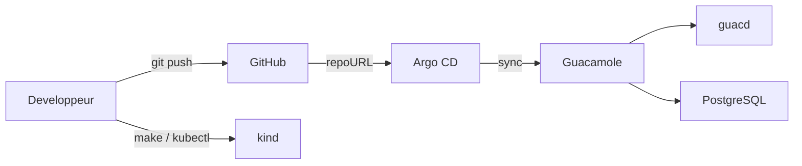

# Argo CD Guacamole Bastion

[](https://github.com/RobinThiriet/ArgoCD/actions/workflows/validate.yml)
[](https://kubernetes.io/)
[](https://argo-cd.readthedocs.io/)
[](https://opengitops.dev/)
[](https://www.docker.com/)
[](https://kind.sigs.k8s.io/)

Repository GitOps pour deployer un bastion Apache Guacamole sur Kubernetes avec Argo CD, `kind` et Docker.

Cette branche est volontairement simple:

- une seule application `guacamole`
- un seul namespace `guacamole`
- une seule URL `http://guacamole.local`
- une seule `Application` Argo CD

## Vision

Le projet sert a travailler en direct sur une seule plateforme Guacamole sans separation `dev/staging/prod`.

GitHub reste la source de verite:

- tu modifies les manifests dans `apps/guacamole`
- tu commits et tu pushes
- Argo CD synchronise automatiquement le cluster

## Architecture



Le detail est dans [docs/architecture.md](/root/ArgoCD/docs/architecture.md#L1).

## Structure du repository

```text
.
|-- Makefile
|-- README.md
|-- Workflow
|   |-- README.md
|   `-- guacamole-bastion.md
|-- apps
|   `-- guacamole
|       |-- base
|       `-- kustomization.yaml
|-- argocd
|   |-- applications
|   |   `-- guacamole.yaml
|   `-- projects
|       `-- bastion-project.yaml
|-- docs
|   |-- architecture.md
|   |-- getting-started.md
|   |-- gitops-workflow.md
|   `-- ...
`-- scripts
    `-- ...
```

## Demarrage rapide

### 1. Creer le cluster

```bash
make cluster-up
```

### 2. Installer l'Ingress local

```bash
make ingress-install
make hosts-print
```

Ajoute ensuite dans `/etc/hosts`:

```text
127.0.0.1 guacamole.local
```

### 3. Installer Argo CD

```bash
make argocd-install
make argocd-password
make argocd-ui
```

UI Argo CD:

```text
https://localhost:8080
```

### 4. Pousser la branche

```bash
git add .
git commit -m "chore: simplify guacamole platform"
git push origin feat/guacamole-bastion
```

### 5. Bootstrap GitOps

```bash
make gitops-bootstrap
```

### 6. Ouvrir Guacamole

Acces recommande:

```text
http://guacamole.local
```

Acces port-forward de secours:

```bash
make guacamole-ui
```

## Workflow GitOps

Le workflow normal est:

1. modifier `apps/guacamole`
2. lancer `make validate`
3. commit et push
4. laisser Argo CD synchroniser
5. verifier dans l'UI Argo CD
6. tester sur `http://guacamole.local`

## Gestion des secrets

Les `Secret` versionnes dans Git contiennent des placeholders, par exemple:

```text
CHANGE_ME_GUACAMOLE_DB_PASSWORD
```

Le but est:

- de garder le repository publiable
- de ne pas pousser de vrais mots de passe dans GitHub
- de conserver un lab GitOps fonctionnel

## Commandes utiles

| Commande | Role |
| --- | --- |
| `make cluster-up` | Cree le cluster `kind`. |
| `make ingress-install` | Installe `ingress-nginx`. |
| `make hosts-print` | Affiche la ligne `/etc/hosts` a ajouter. |
| `make argocd-install` | Installe Argo CD. |
| `make argocd-password` | Recupere le mot de passe admin initial. |
| `make argocd-ui` | Ouvre l'UI Argo CD. |
| `make gitops-bootstrap` | Cree l'application Guacamole dans Argo CD. |
| `make guacamole-ui` | Ouvre Guacamole en port-forward. |
| `make status` | Affiche l'etat du cluster. |
| `make validate` | Valide les manifests et les scripts. |
| `make destroy` | Supprime le cluster local. |

## Documentation detaillee

- [Workflow/README.md](/root/ArgoCD/Workflow/README.md#L1)
- [Workflow/guacamole-bastion.md](/root/ArgoCD/Workflow/guacamole-bastion.md#L1)
- [docs/getting-started.md](/root/ArgoCD/docs/getting-started.md#L1)
- [docs/architecture.md](/root/ArgoCD/docs/architecture.md#L1)
- [docs/gitops-workflow.md](/root/ArgoCD/docs/gitops-workflow.md#L1)
- [docs/runbook.md](/root/ArgoCD/docs/runbook.md#L1)

## Prochaines evolutions

- activer TLS
- integrer le SSO SAML
- remplacer les placeholders de secrets par une solution GitOps-compatible
