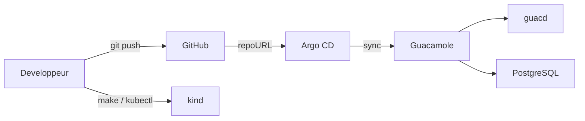

# Argo CD Guacamole Bastion

[](https://github.com/RobinThiriet/ArgoCD/actions/workflows/validate.yml)
[](https://kubernetes.io/)
[](https://argo-cd.readthedocs.io/)
[](https://opengitops.dev/)
[](https://www.docker.com/)
[](https://kind.sigs.k8s.io/)

Repository GitOps professionnel pour deployer un bastion Apache Guacamole sur Kubernetes avec Argo CD, `kind` et Docker.

Cette branche `feat/guacamole-bastion` est volontairement centree sur une seule plateforme:

- `guacamole` pour l'interface web;
- `guacd` pour le proxy de protocoles distants;
- `postgresql` pour la persistence;
- `Ingress` local avec URLs stables par environnement;
- `Secret` Kubernetes avec placeholders documentes pour ne pas pousser de vrais mots de passe dans GitHub.

## Sommaire

- [Vision](#vision)
- [Architecture](#architecture)
- [Structure du repository](#structure-du-repository)
- [Demarrage rapide](#demarrage-rapide)
- [Workflow GitOps](#workflow-gitops)
- [Gestion des secrets](#gestion-des-secrets)
- [Commandes utiles](#commandes-utiles)
- [Documentation detaillee](#documentation-detaillee)
- [Prochaines evolutions](#prochaines-evolutions)

## Vision

Le but du projet est de fournir un vrai mini socle d'exploitation GitOps:

- GitHub porte l'etat desire;
- Argo CD reconcilie cet etat dans Kubernetes;
- Guacamole est decrit de maniere declarative dans `apps/guacamole`;
- `dev`, `staging` et `prod` sont geres par overlays Kustomize.

La branche ne sert donc pas de lab multi-applications. Elle sert de base propre pour un bastion Guacamole realiste et evolutif.

## Architecture

### Vue d'ensemble



### Plan architectural

```mermaid
flowchart TB
    subgraph Local["Poste local"]
        Docker[Docker Engine]
        CLI[kubectl / kind / git / make]
        Repo[Repository local]
        Hosts[/etc/hosts]
    end

    subgraph GitHub["GitHub"]
        Origin[RobinThiriet/ArgoCD]
    end

    subgraph Cluster["Cluster kind : argocd-lab"]
        subgraph ArgoNs["Namespace argocd"]
            Server[argocd-server]
            RepoServer[argocd-repo-server]
            Controller[argocd-application-controller]
        end

        subgraph BastionDev["Namespace guacamole"]
            IngressDev[Ingress guacamole.local]
            WebDev[Deployment guacamole]
            GuacdDev[Deployment guacd]
            DbDev[StatefulSet postgresql]
            PvcDev[PersistentVolumeClaim]
            SecretDev[Secret guacamole-secrets]
        end

        subgraph BastionOther["Autres environnements"]
            Staging[Namespace guacamole-staging]
            Prod[Namespace guacamole-prod]
        end
    end

    CLI --> Repo
    CLI --> Docker
    Hosts --> IngressDev
    Repo -->|git push| Origin
    Docker --> Cluster
    Origin --> RepoServer
    Controller --> WebDev
    Controller --> GuacdDev
    Controller --> DbDev
    IngressDev --> WebDev
    WebDev --> GuacdDev
    WebDev --> DbDev
    DbDev --> PvcDev
    WebDev --> SecretDev
    DbDev --> SecretDev
```

### Responsabilites

| Composant | Role |
| --- | --- |
| `apps/guacamole` | Decrit Guacamole, `guacd`, PostgreSQL, les secrets et l'Ingress. |
| `argocd/projects` | Contient le `AppProject` du bastion. |
| `argocd/applications` | Contient une `Application` Argo CD par environnement. |
| `scripts/` | Automatise le cluster, Argo CD, l'Ingress et le bootstrap GitOps. |
| `Workflow/` | Documente le workflow d'utilisation quotidien et le workflow Guacamole. |
| `docs/` | Regroupe l'architecture, le runbook et les guides. |

Le detail architectural est documente dans [docs/architecture.md](/root/ArgoCD/docs/architecture.md#L1).

## Structure du repository

```text
.
|-- Makefile
|-- README.md
|-- Workflow
|   |-- README.md
|   `-- guacamole-bastion.md
|-- apps
|   `-- guacamole
|       |-- base
|       |   |-- guacamole-deployment.yaml
|       |   |-- guacd-deployment.yaml
|       |   |-- ingress.yaml
|       |   |-- postgresql-statefulset.yaml
|       |   |-- secret.yaml
|       |   `-- ...
|       |-- kustomization.yaml
|       `-- overlays
|           |-- dev
|           |-- staging
|           `-- prod
|-- argocd
|   |-- applications
|   |   |-- guacamole-dev.yaml
|   |   |-- guacamole-staging.yaml
|   |   `-- guacamole-prod.yaml
|   `-- projects
|       `-- bastion-project.yaml
|-- docs
|   |-- README.md
|   |-- application-catalog.md
|   |-- architecture.md
|   |-- environment-strategy.md
|   |-- getting-started.md
|   |-- gitops-workflow.md
|   |-- runbook.md
|   `-- ...
`-- scripts
    |-- bootstrap-gitops.sh
    |-- create-cluster.sh
    |-- install-argocd.sh
    |-- install-ingress-nginx.sh
    |-- port-forward-app.sh
    `-- ...
```

## Demarrage rapide

### Prerequis

- Docker
- `kubectl`
- `kind`
- `git`
- `make`

### 1. Creer le cluster

```bash
make cluster-up
```

### 2. Installer l'Ingress local

```bash
make ingress-install
make hosts-print
```

Ajoute ensuite dans `/etc/hosts`:

```text
127.0.0.1 guacamole.local
127.0.0.1 guacamole-staging.local
127.0.0.1 guacamole-prod.local
```

### 3. Installer Argo CD

```bash
make argocd-install
make argocd-password
make argocd-ui
```

UI Argo CD:

```text
https://localhost:8080
```

### 4. Pousser la branche

```bash
git add .
git commit -m "chore: bootstrap guacamole bastion"
git push origin feat/guacamole-bastion
```

### 5. Bootstrap GitOps

```bash
make gitops-bootstrap
make gitops-bootstrap APP_ENV=staging
make gitops-bootstrap APP_ENV=prod
```

Ou tout d'un coup:

```bash
make gitops-bootstrap-all
```

### 6. Ouvrir Guacamole

Acces recommande:

- `http://guacamole.local`
- `http://guacamole-staging.local`
- `http://guacamole-prod.local`

Acces port-forward de secours:

```bash
make guacamole-ui
make guacamole-ui APP_ENV=staging
make guacamole-ui APP_ENV=prod
```

## Workflow GitOps

Le workflow normal est:

1. tu modifies `apps/guacamole/base` ou `apps/guacamole/overlays/<env>`;
2. tu lances `make validate`;
3. tu commits et tu pushes;
4. Argo CD detecte le diff et synchronise;
5. tu verifies `Synced` et `Healthy`;
6. tu testes via l'Ingress ou le port-forward.

En une phrase:

```text
Je decris Guacamole dans Git, je pousse, Argo CD applique, puis je verifie.
```

Le detail est dans [Workflow/README.md](/root/ArgoCD/Workflow/README.md#L1) et [Workflow/guacamole-bastion.md](/root/ArgoCD/Workflow/guacamole-bastion.md#L1).

## Gestion des secrets

Les `Secret` Kubernetes presents dans Git contiennent des placeholders lisibles, par exemple:

```text
CHANGE_ME_GUACAMOLE_DEV_DB_PASSWORD
```

L'idee est simple:

- on versionne la structure du secret;
- on ne publie pas de vrai mot de passe dans GitHub;
- le lab reste fonctionnel localement.

Pour un vrai environnement, il faudra evoluer vers:

- `Sealed Secrets`
- `SOPS`
- `External Secrets`

## Commandes utiles

| Commande | Role |
| --- | --- |
| `make cluster-up` | Cree le cluster `kind`. |
| `make ingress-install` | Installe `ingress-nginx`. |
| `make hosts-print` | Affiche les lignes `/etc/hosts` a ajouter. |
| `make argocd-install` | Installe Argo CD. |
| `make argocd-password` | Recupere le mot de passe admin initial. |
| `make argocd-ui` | Ouvre l'UI Argo CD en port-forward. |
| `make gitops-bootstrap` | Bootstrap un environnement Guacamole. |
| `make gitops-bootstrap-all` | Bootstrap `dev`, `staging` et `prod`. |
| `make guacamole-ui` | Ouvre Guacamole en port-forward. |
| `make status` | Affiche l'etat du cluster et des namespaces Guacamole. |
| `make validate` | Valide scripts et manifests Kustomize. |
| `make destroy` | Supprime le cluster local. |

## Documentation detaillee

- [Workflow/README.md](/root/ArgoCD/Workflow/README.md#L1)
- [Workflow/guacamole-bastion.md](/root/ArgoCD/Workflow/guacamole-bastion.md#L1)
- [docs/getting-started.md](/root/ArgoCD/docs/getting-started.md#L1)
- [docs/architecture.md](/root/ArgoCD/docs/architecture.md#L1)
- [docs/application-catalog.md](/root/ArgoCD/docs/application-catalog.md#L1)
- [docs/environment-strategy.md](/root/ArgoCD/docs/environment-strategy.md#L1)
- [docs/gitops-workflow.md](/root/ArgoCD/docs/gitops-workflow.md#L1)
- [docs/runbook.md](/root/ArgoCD/docs/runbook.md#L1)

## Prochaines evolutions

- activer TLS sur l'Ingress;
- integrer le SSO SAML;
- remplacer les placeholders de secrets par une vraie solution GitOps-compatible;
- ajouter des politiques de securite et des checks CI plus pousses.
