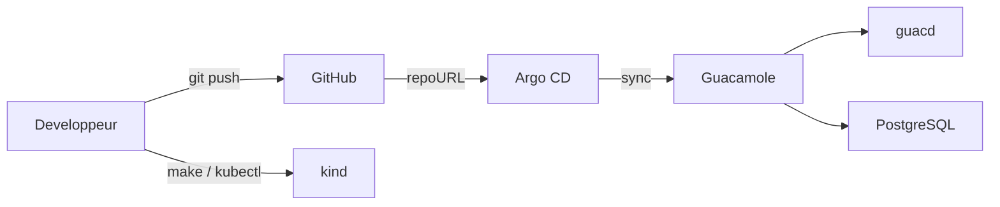

# Argo CD Guacamole Bastion

[](https://github.com/RobinThiriet/ArgoCD/actions/workflows/validate.yml)
[](https://kubernetes.io/)
[](https://argo-cd.readthedocs.io/)
[](https://opengitops.dev/)
[](https://www.docker.com/)
[](https://kind.sigs.k8s.io/)

Repository GitOps pour deployer un bastion Apache Guacamole sur Kubernetes avec Argo CD, `kind` et Docker.

Le repository est volontairement recentre sur une plateforme unique:

- une seule application metier: `guacamole`;
- un seul namespace applicatif: `guacamole`;
- un acces local stable via Ingress;
- une seule `Application` Argo CD;
- un parcours GitOps simple a suivre pas a pas.

## Vue d'ensemble

La plateforme deploie:

- `guacamole` pour l'interface web;
- `guacd` pour le broker de sessions;
- `postgresql` pour la persistance;
- un `Ingress` local pour `guacamole.local`;
- un acces local a Argo CD via `argocd.local`.

GitHub reste la source de verite:

1. tu modifies les manifests dans `apps/guacamole`;
2. tu lances `make validate`;
3. tu commit et tu push;
4. Argo CD synchronise automatiquement le cluster.

## Architecture



Le detail est dans [docs/architecture.md](/root/ArgoCD/docs/architecture.md).

## Structure du repository

```text
.
|-- Makefile
|-- README.md
|-- Workflow
|   |-- README.md
|   `-- guacamole-bastion.md
|-- apps
|   `-- guacamole
|       |-- base
|       `-- kustomization.yaml
|-- argocd
|   |-- applications
|   |   `-- guacamole.yaml
|   |-- local-access
|   `-- projects
|       `-- bastion-project.yaml
|-- docs
|-- kind
`-- scripts
```

## Demarrage rapide

### Prerequis

- Docker
- `kubectl`
- `kind`
- `git`
- `make`

### 1. Creer le cluster

```bash
make cluster-up
```

Cette etape cree un cluster `kind` avec les ports `80` et `443` exposes en local pour l'Ingress.

### 2. Installer l'Ingress local

```bash
make ingress-install
make hosts-print
```

Ajoute ensuite dans `/etc/hosts`:

```text
127.0.0.1 argocd.local
127.0.0.1 guacamole.local
```

### 3. Installer Argo CD

```bash
make argocd-install
make argocd-password
```

Acces Argo CD:

```text
http://argocd.local
```

### 4. Pousser la branche

```bash
git add .
git commit -m "chore: update guacamole bastion"
git push origin main
```

Le bootstrap GitOps verifie que le depot local est propre et synchronise avec `origin/main`.

### 5. Bootstrap GitOps

```bash
make gitops-bootstrap
```

Resultat attendu:

- `bastion-project` cree dans Argo CD;
- `guacamole` cree dans Argo CD;
- namespace `guacamole` cree automatiquement;
- application `Synced` et `Healthy` apres reconciliation.

### 6. Ouvrir Guacamole

Acces recommande:

```text
http://guacamole.local
```

Acces de secours en port-forward:

```bash
make guacamole-ui
```

### 7. Connexion initiale

Identifiants Guacamole par defaut:

- utilisateur: `guacadmin`;
- mot de passe: `guacadmin`.

Action recommandee:

- changer immediatement le mot de passe administrateur apres la premiere connexion.

## Workflow GitOps

Le workflow normal est:

1. modifier `apps/guacamole`;
2. lancer `make validate`;
3. commit et push;
4. laisser Argo CD synchroniser;
5. verifier dans `http://argocd.local`;
6. tester sur `http://guacamole.local`.

## Gestion des secrets

Le `Secret` versionne dans Git contient des placeholders, par exemple:

```text
CHANGE_ME_GUACAMOLE_DB_PASSWORD
```

Le but est:

- de garder le repository publiable;
- de ne pas pousser de vrais mots de passe dans Git;
- de conserver un lab GitOps fonctionnel.

## Commandes utiles

| Commande | Role |
| --- | --- |
| `make cluster-up` | Cree le cluster `kind`. |
| `make ingress-install` | Installe `ingress-nginx`. |
| `make hosts-print` | Affiche les entrees `/etc/hosts` a ajouter. |
| `make argocd-install` | Installe Argo CD et l'acces local Ingress. |
| `make argocd-password` | Recupere le mot de passe admin initial. |
| `make argocd-ui` | Ouvre un port-forward de secours vers Argo CD. |
| `make gitops-bootstrap` | Cree l'application Guacamole dans Argo CD. |
| `make guacamole-ui` | Ouvre Guacamole en port-forward. |
| `make status` | Affiche l'etat du cluster. |
| `make validate` | Valide les manifests et les scripts. |
| `make destroy` | Supprime le cluster local. |

## Documentation detaillee

- [Workflow/README.md](/root/ArgoCD/Workflow/README.md)
- [Workflow/guacamole-bastion.md](/root/ArgoCD/Workflow/guacamole-bastion.md)
- [docs/getting-started.md](/root/ArgoCD/docs/getting-started.md)
- [docs/architecture.md](/root/ArgoCD/docs/architecture.md)
- [docs/gitops-workflow.md](/root/ArgoCD/docs/gitops-workflow.md)
- [docs/saml-auth.md](/root/ArgoCD/docs/saml-auth.md)
- [docs/runbook.md](/root/ArgoCD/docs/runbook.md)

## Prochaines evolutions

- activer TLS;
- integrer le SSO SAML;
- remplacer les placeholders de secrets par une solution GitOps-compatible.
