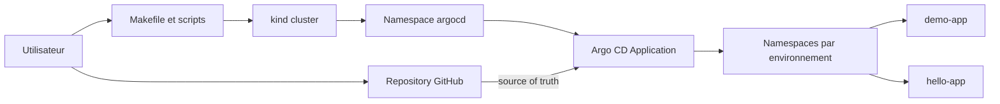
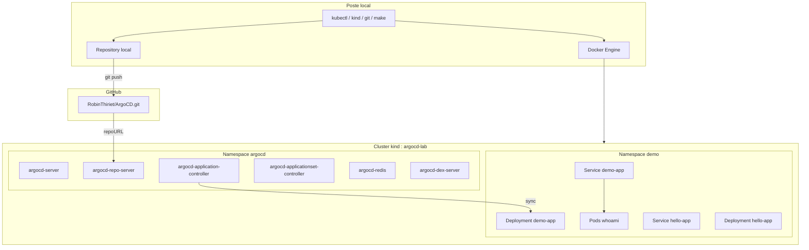

# Argo CD GitOps Lab

[](https://github.com/RobinThiriet/ArgoCD/actions/workflows/validate.yml)
[](https://kubernetes.io/)
[](https://argo-cd.readthedocs.io/)
[](https://opengitops.dev/)
[](https://www.docker.com/)
[](https://kind.sigs.k8s.io/)

Base de travail professionnelle pour decouvrir Argo CD, Kubernetes et le GitOps en local a l'aide de Docker via `kind`.

Ce depot a deux objectifs:

- fournir un environnement de demonstration simple, reproductible et versionne;
- servir de support pedagogique pour comprendre comment Argo CD reconcilie l'etat de Kubernetes a partir d'un repository Git.

## Sommaire

- [Vision du projet](#vision-du-projet)
- [Objectifs](#objectifs)
- [Architecture](#architecture)
- [Structure du repository](#structure-du-repository)
- [Demarrage rapide](#demarrage-rapide)
- [Workflow GitOps](#workflow-gitops)
- [Catalogue d'applications](#catalogue-dapplications)
- [Strategie d'environnements](#strategie-denvironnements)
- [Standards du depot](#standards-du-depot)
- [Commandes utiles](#commandes-utiles)
- [Documentation detaillee](#documentation-detaillee)
- [Projection cible](#projection-cible)
- [Roadmap suggeree](#roadmap-suggeree)

## Vision du projet

Ce projet met en place un socle GitOps local compose de:

- un cluster Kubernetes local cree avec `kind`;
- une installation Argo CD complete dans le namespace `argocd`;
- une application de demonstration deployee via plusieurs environnements;
- une seconde application pour illustrer la montee en charge du repository;
- un flux GitOps ou GitHub devient la source de verite.

Le depot est pense comme un mini environnement de reference: lisible, scriptable, documente, et suffisamment structure pour evoluer vers plusieurs applications par la suite.

## Objectifs

- comprendre le role d'Argo CD dans une chaine GitOps;
- apprendre a deployer une application Kubernetes depuis un repository Git;
- comprendre comment organiser `dev`, `staging` et `prod` avec Kustomize;
- separer clairement l'infrastructure locale, les objets Argo CD et les manifests applicatifs;
- disposer d'une base propre pour des evolutions futures: overlays, environnements, Helm ou ApplicationSets.

## Architecture

### Vue d'ensemble



### Plan architectural



### Composants et responsabilites

| Composant | Role |
| --- | --- |
| `kind` | Cree un cluster Kubernetes local dans Docker. |
| `argocd/` | Contient les objets Argo CD (`AppProject`, `Application`) par environnement. |
| `apps/` | Contient les applications Kubernetes versionnees (`demo-app`, `hello-app`). |
| `scripts/` | Automatise les operations locales recurrentes. |
| `Makefile` | Fournit un point d'entree operable et lisible. |
| GitHub | Source de verite du flux GitOps. |

### Principes d'architecture

- Git est la source de verite.
- Argo CD reconcilie l'etat du cluster a partir du repository.
- Le poste local sert uniquement a produire et pousser le changement.
- Les objets Argo CD sont separes des manifests applicatifs.
- Le cluster local reste ephemere et reproductible.

Pour le detail architectural, voir [docs/architecture.md](/root/ArgoCD/docs/architecture.md).

## Structure du repository

```text
.
|-- Makefile
|-- README.md
|-- Workflow
|   `-- README.md
|-- apps
|   |-- demo-app
|   |   |-- base
|   |   |-- kustomization.yaml
|   |   `-- overlays
|   `-- hello-app
|       |-- base
|       |-- kustomization.yaml
|       `-- overlays
|-- argocd
|   |-- applications
|   |   |-- demo-app-dev.yaml
|   |   |-- hello-app-dev.yaml
|   |   |-- demo-app-prod.yaml
|   |   |-- hello-app-prod.yaml
|   |   `-- demo-app-staging.yaml
|   `-- projects
|       `-- demo-project.yaml
|-- docs
|   |-- README.md
|   |-- application-catalog.md
|   |-- architecture.md
|   |-- environment-strategy.md
|   |-- getting-started.md
|   |-- gitops-workflow.md
|   |-- runbook.md
|   |-- glossary.md
|   `-- adr
|       |-- 0001-kind-local-lab.md
|       `-- README.md
`-- scripts
    |-- argocd-password.sh
    |-- bootstrap-gitops.sh
    |-- create-cluster.sh
    |-- install-argocd.sh
    |-- port-forward-app.sh
    |-- port-forward-argocd.sh
    `-- ...
```

## Demarrage rapide

### Prerequis

- Docker
- `kubectl`
- `kind`
- `git`
- `make`

### 1. Creer le cluster local

```bash
make cluster-up
```

### 2. Installer Argo CD

```bash
make argocd-install
```

### 3. Recuperer le mot de passe administrateur

```bash
make argocd-password
```

### 4. Exposer l'interface Argo CD

Dans un premier terminal:

```bash
make argocd-ui
```

Acces navigateur:

```text
https://localhost:8080
```

Connexion:

- utilisateur: `admin`
- mot de passe: sortie de `make argocd-password`

### 5. Versionner et pousser le depot

Argo CD lit les manifests depuis GitHub. Le bootstrap GitOps ne doit donc etre fait qu'une fois les fichiers commites et pushes.

```bash
git add .
git commit -m "chore: bootstrap argocd lab"
git push origin main
```

### 6. Declarer l'application GitOps

```bash
make gitops-bootstrap
```

Cette commande applique:

- le `AppProject` `demo-project`;
- toutes les `Application` de l'environnement `dev`;
- la configuration de synchronisation automatique sur l'environnement `dev`.

### 7. Exposer l'application de demonstration

Dans un second terminal:

```bash
make demo-ui
```

Acces navigateur:

```text
http://localhost:8081
```

Seconde application:

```bash
make app-ui APP_NAME=hello-app
```

Acces navigateur:

```text
http://localhost:8181
```

Le guide detaille est disponible dans [docs/getting-started.md](/root/ArgoCD/docs/getting-started.md).

## Workflow GitOps

Le cycle cible est le suivant:

1. modification des manifests Kubernetes dans le repository;
2. commit local;
3. `git push` vers GitHub;
4. detection du changement par Argo CD;
5. reconciliation automatique du cluster;
6. verification dans l'interface Argo CD et via `kubectl`.

Exemple de premier exercice:

1. modifier [`apps/demo-app/overlays/dev/deployment-patch.yaml`](/root/ArgoCD/apps/demo-app/overlays/dev/deployment-patch.yaml#L1);
2. changer `replicas: 2` en `replicas: 3`;
3. commit et push;
4. observer la resynchronisation dans Argo CD.

Le detail du cycle est documente dans [docs/gitops-workflow.md](/root/ArgoCD/docs/gitops-workflow.md).

## Catalogue d'applications

Le repository contient maintenant deux applications pour montrer comment le modele GitOps evolue quand le nombre d'apps augmente.

| Application | Role | Image | Service |
| --- | --- | --- | --- |
| `demo-app` | Application de demonstration principale | `traefik/whoami:v1.10.1` | `svc/demo-app` |
| `hello-app` | Seconde application d'exemple pour illustrer la scalabilite du depot | `nginxdemos/hello:0.4` | `svc/hello-app` |

Exemples d'acces local:

```bash
make demo-ui
make app-ui APP_NAME=hello-app
make app-ui APP_NAME=hello-app APP_ENV=staging
```

## Strategie d'environnements

Le depot supporte maintenant une vraie organisation `dev/staging/prod`:

- `base/` contient les manifests communs;
- `overlays/dev` cible le namespace `demo`;
- `overlays/staging` cible le namespace `demo-staging`;
- `overlays/prod` cible le namespace `demo-prod`.
- chaque environnement peut contenir plusieurs applications Argo CD.

Par souci de simplicite:

- `make gitops-bootstrap` deploye `dev` par defaut;
- `make demo-ui` ouvre `dev` par defaut;
- `make app-ui APP_NAME=hello-app` ouvre la seconde application;
- `apps/demo-app/kustomization.yaml` continue a fournir un point d'entree simple pour `dev`.

Exemples:

```bash
make gitops-bootstrap APP_ENV=staging
make gitops-bootstrap APP_ENV=prod
make gitops-bootstrap-all
make demo-ui APP_ENV=staging
make app-ui APP_NAME=hello-app APP_ENV=prod
```

La strategie complete est decrite dans [docs/environment-strategy.md](/root/ArgoCD/docs/environment-strategy.md).

## Standards du depot

Le depot embarque maintenant un socle de standards pour se rapprocher d'un repository d'equipe:

- guide de contribution dans [CONTRIBUTING.md](/root/ArgoCD/CONTRIBUTING.md);
- proprietaire par defaut dans [CODEOWNERS](/root/ArgoCD/CODEOWNERS);
- template de Pull Request dans [.github/PULL_REQUEST_TEMPLATE.md](/root/ArgoCD/.github/PULL_REQUEST_TEMPLATE.md);
- validation continue dans [.github/workflows/validate.yml](/root/ArgoCD/.github/workflows/validate.yml);
- conventions de structure dans [docs/repository-standards.md](/root/ArgoCD/docs/repository-standards.md).

Conventions recommandees:

- branches: `feat/*`, `fix/*`, `docs/*`, `chore/*`, `refactor/*`;
- commits: `feat:`, `fix:`, `docs:`, `chore:`, `refactor:`, `test:`;
- validation minimale avant PR: `make validate`.

## Commandes utiles

| Commande | Description |
| --- | --- |
| `make help` | Affiche les commandes disponibles. |
| `make cluster-up` | Cree le cluster `kind`. |
| `make argocd-install` | Installe Argo CD dans le namespace `argocd`. |
| `make argocd-password` | Affiche le mot de passe admin initial. |
| `make argocd-ui` | Port-forward vers l'interface Argo CD. |
| `make gitops-bootstrap` | Applique toutes les applications d'un environnement Argo CD. |
| `make gitops-bootstrap-all` | Applique toutes les applications sur `dev`, `staging` et `prod`. |
| `make demo-ui` | Ouvre `demo-app` en local. |
| `make app-ui APP_NAME=hello-app` | Ouvre une application specifique en local. |
| `make status` | Affiche l'etat du cluster, d'Argo CD et des applications. |
| `make validate` | Verifie les scripts shell et le rendu Kustomize. |
| `make destroy` | Supprime le cluster local. |

## Documentation detaillee

- [Documentation index](/root/ArgoCD/docs/README.md)
- [Architecture](/root/ArgoCD/docs/architecture.md)
- [Getting started](/root/ArgoCD/docs/getting-started.md)
- [Catalogue d'applications](/root/ArgoCD/docs/application-catalog.md)
- [Strategie d'environnements](/root/ArgoCD/docs/environment-strategy.md)
- [Workflow GitOps](/root/ArgoCD/docs/gitops-workflow.md)
- [Workflow d'utilisation Argo CD](/root/ArgoCD/Workflow/README.md)
- [Runbook d'exploitation](/root/ArgoCD/docs/runbook.md)
- [Glossaire](/root/ArgoCD/docs/glossary.md)
- [Repository standards](/root/ArgoCD/docs/repository-standards.md)
- [Target structure](/root/ArgoCD/docs/target-structure.md)
- [ADR](/root/ArgoCD/docs/adr/README.md)

## Projection cible

La structure actuelle est volontairement simple pour l'apprentissage. La cible d'architecture du depot est deja documentee pour une evolution vers plusieurs environnements et plusieurs applications.

Vue cible:

```text
apps/
  <application>/
    base/
    overlays/
      dev/
      staging/
      prod/

argocd/
  projects/
  applications/
```

Cette trajectoire est detaillee dans [docs/target-structure.md](/root/ArgoCD/docs/target-structure.md).

## Roadmap suggeree

- ajouter un environnement `staging` via overlays Kustomize;
- introduire une seconde application pour illustrer la mise a l'echelle;
- remplacer la demo simple par une application maison;
- ajouter des policies, secrets et observabilite;
- introduire `ApplicationSet` pour gerer plusieurs cibles.

## References

- Argo CD Getting Started: https://argo-cd.readthedocs.io/en/stable/getting_started/
- kind Quick Start: https://kind.sigs.k8s.io/docs/user/quick-start/
- Kubernetes Concepts: https://kubernetes.io/docs/concepts/
