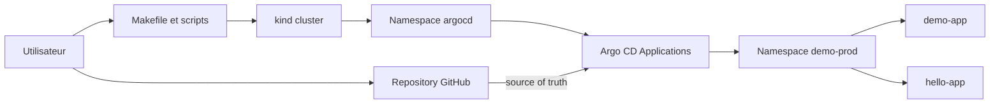

# Argo CD GitOps Lab

[](https://github.com/RobinThiriet/ArgoCD/actions/workflows/validate.yml)
[](https://kubernetes.io/)
[](https://argo-cd.readthedocs.io/)
[](https://opengitops.dev/)
[](https://www.docker.com/)
[](https://kind.sigs.k8s.io/)

Base de travail pour decouvrir Argo CD, Kubernetes et le GitOps en local avec `kind`.

## Vision du projet

Le depot fournit:

- un cluster Kubernetes local cree avec `kind`;
- une installation Argo CD dans le namespace `argocd`;
- deux applications d'exemple (`demo-app` et `hello-app`);
- un flux GitOps ou GitHub reste la source de verite;
- un deploiement `prod` unique sur la branche `main`.

## Objectifs

- comprendre le role d'Argo CD dans une chaine GitOps;
- apprendre a deployer une application Kubernetes depuis un repository Git;
- separer clairement les manifests applicatifs et les objets Argo CD;
- disposer d'une base simple et propre pour evoluer ensuite.

## Architecture



Le detail architectural est disponible dans [docs/architecture.md](/root/ArgoCD/docs/architecture.md).

## Structure du repository

```text
.
|-- Makefile
|-- README.md
|-- Workflow
|   `-- README.md
|-- apps
|   |-- demo-app
|   |   |-- base
|   |   |-- kustomization.yaml
|   |   `-- overlays
|   |       `-- prod
|   `-- hello-app
|       |-- base
|       |-- kustomization.yaml
|       `-- overlays
|           `-- prod
|-- argocd
|   |-- applications
|   |   |-- demo-app-prod.yaml
|   |   `-- hello-app-prod.yaml
|   `-- projects
|       `-- demo-project.yaml
|-- docs
|-- scripts
`-- CONTRIBUTING.md
```

## Demarrage rapide

### Prerequis

- Docker
- `kubectl`
- `kind`
- `git`
- `make`

### 1. Creer le cluster local

```bash
make cluster-up
```

### 2. Installer Argo CD

```bash
make argocd-install
```

### 3. Recuperer le mot de passe admin

```bash
make argocd-password
```

### 4. Ouvrir l'UI Argo CD

```bash
make argocd-ui
```

Acces: `https://localhost:8080`

### 5. Commit et push

```bash
git add .
git commit -m "chore: bootstrap argocd lab"
git push origin main
```

### 6. Declarer les applications GitOps

```bash
make gitops-bootstrap
```

Cette commande applique:

- le `AppProject` `demo-project`;
- `demo-app-prod`;
- `hello-app-prod`.

### 7. Ouvrir les applications

```bash
make demo-ui
make app-ui APP_NAME=hello-app
```

Acces:

- `http://localhost:8083` pour `demo-app`;
- `http://localhost:8183` pour `hello-app`.

## Workflow GitOps

Le cycle cible est le suivant:

1. modifier les manifests Kubernetes dans le repository;
2. commit local;
3. `git push` vers GitHub;
4. detection du changement par Argo CD;
5. reconciliation automatique du cluster;
6. verification dans l'interface Argo CD et via `kubectl`.

Exemple:

1. modifier [`apps/demo-app/overlays/prod/deployment-patch.yaml`](/root/ArgoCD/apps/demo-app/overlays/prod/deployment-patch.yaml#L1);
2. changer le nombre de replicas;
3. commit et push;
4. observer la resynchronisation dans Argo CD.

## Catalogue d'applications

| Application | Role | Image | Service |
| --- | --- | --- | --- |
| `demo-app` | Application de demonstration principale | `traefik/whoami:v1.10.1` | `svc/demo-app` |
| `hello-app` | Seconde application d'exemple | `nginxdemos/hello:0.4` | `svc/hello-app` |

## Strategie d'environnement

La branche `main` est maintenant alignee sur un seul environnement:

- `base/` contient les manifests communs;
- `overlays/prod` contient la variation active;
- `demo-prod` est le namespace cible;
- les applications Argo CD actives sont `demo-app-prod` et `hello-app-prod`.

Le detail est dans [docs/environment-strategy.md](/root/ArgoCD/docs/environment-strategy.md).

## Commandes utiles

| Commande | Description |
| --- | --- |
| `make help` | Affiche les commandes disponibles. |
| `make cluster-up` | Cree le cluster `kind`. |
| `make argocd-install` | Installe Argo CD dans le namespace `argocd`. |
| `make argocd-password` | Affiche le mot de passe admin initial. |
| `make argocd-ui` | Port-forward vers l'interface Argo CD. |
| `make gitops-bootstrap` | Applique les applications Argo CD de `prod`. |
| `make gitops-bootstrap-all` | Applique toutes les applications presentes dans `argocd/applications/`. |
| `make demo-ui` | Ouvre `demo-app` en local. |
| `make app-ui APP_NAME=hello-app` | Ouvre `hello-app` en local. |
| `make status` | Affiche l'etat du cluster, d'Argo CD et des applications. |
| `make validate` | Verifie les scripts shell et le rendu Kustomize. |
| `make destroy` | Supprime le cluster local. |

## Documentation detaillee

- [Documentation index](/root/ArgoCD/docs/README.md)
- [Architecture](/root/ArgoCD/docs/architecture.md)
- [Getting started](/root/ArgoCD/docs/getting-started.md)
- [Catalogue d'applications](/root/ArgoCD/docs/application-catalog.md)
- [Strategie d'environnement](/root/ArgoCD/docs/environment-strategy.md)
- [Workflow GitOps](/root/ArgoCD/docs/gitops-workflow.md)
- [Workflow d'utilisation Argo CD](/root/ArgoCD/Workflow/README.md)
- [Runbook d'exploitation](/root/ArgoCD/docs/runbook.md)
- [Glossaire](/root/ArgoCD/docs/glossary.md)
- [Repository standards](/root/ArgoCD/docs/repository-standards.md)
- [Target structure](/root/ArgoCD/docs/target-structure.md)
- [ADR](/root/ArgoCD/docs/adr/README.md)
