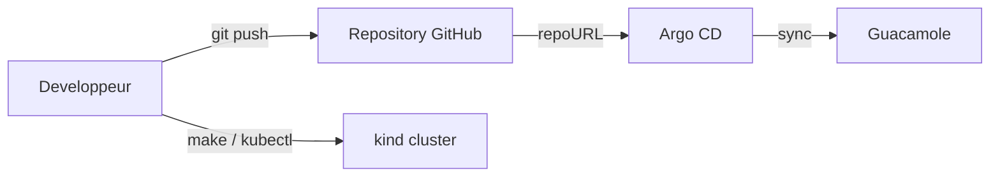
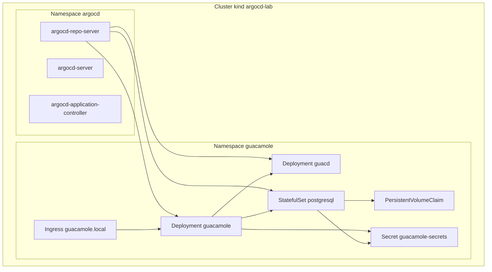

# Architecture

## Contexte

Le projet implemente un bastion Guacamole pilote en GitOps avec un seul environnement de travail.

## Vue logique

## Vue de deploiement

## Decoupage du repository

- `apps/guacamole/` contient les manifests Kubernetes
- `argocd/` contient les objets Argo CD
- `scripts/` automatise les operations locales
- `docs/` contient la documentation projet

## Choix structurants

- `kind` pour un cluster local reproductible
- Argo CD `v3.3.4`
- PostgreSQL persistant
- Ingress local stable sur `guacamole.local`

## Limites actuelles

- pas encore de TLS
- pas encore de SAML
- les secrets restent des placeholders de lab
