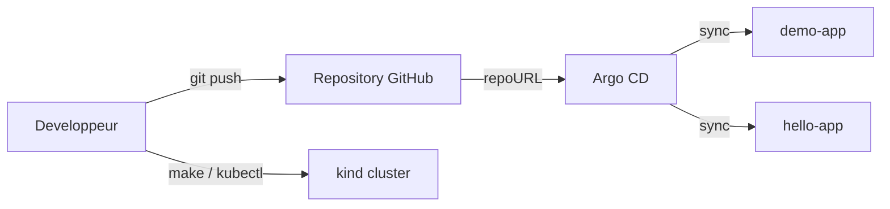
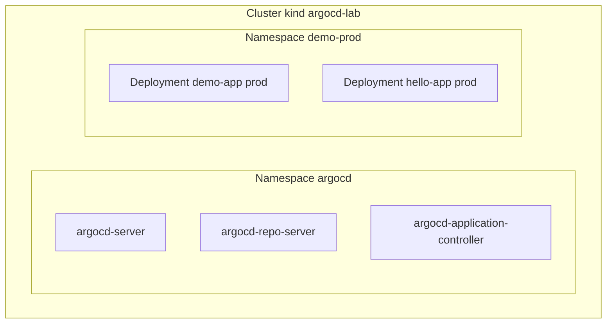

# Architecture

## Contexte

Le projet implemente un laboratoire GitOps local avec Argo CD, centre sur un deploiement `prod` unique sur la branche `main`.

## Vue logique

## Vue de deploiement

## Decoupage du repository

- `apps/`: manifests applicatifs avec `base/` et `overlays/prod/`;
- `argocd/`: `AppProject` et `Application`;
- `scripts/`: automatisation locale;
- `docs/`: documentation de reference.
