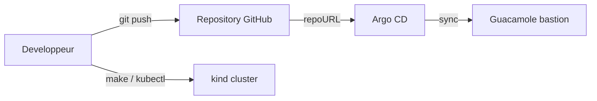
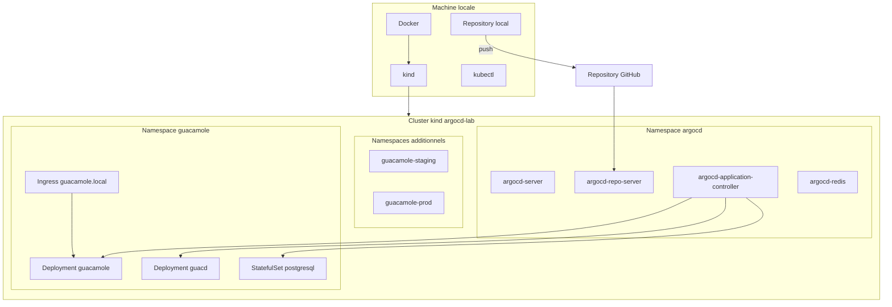

# Architecture

## Contexte

Le projet implemente un bastion Guacamole pilote en GitOps. L'objectif n'est pas seulement d'installer Argo CD, mais de fournir un cadre lisible qui montre clairement:

- ou se trouve la source de verite;
- comment Argo CD accede au repository;
- quels objets pilotent le deploiement;
- quelles limites existent dans un environnement local.

## Vue logique



## Vue de deploiement



## Decoupage du repository

### `apps/`

Zone des manifests applicatifs. C'est la partie metier du depot, independante du controleur GitOps lui-meme.

Guacamole est organise en:

- `base/` pour les manifests communs;
- `overlays/dev`;
- `overlays/staging`;
- `overlays/prod`.

### `argocd/`

Zone de pilotage Argo CD:

- `projects/` pour definir le perimetre d'autorisation;
- `applications/` pour declarer quoi deployer, depuis ou, et vers quelle destination.

### `scripts/`

Scripts shell pour simplifier les operations locales et rendre le lab reproductible.

### `docs/`

Documentation de reference et guides d'exploitation.

## Flux de controle

1. le developpeur modifie la `base` ou l'overlay cible de l'application concernee dans `apps/`;
2. le changement est commit et pousse sur GitHub;
3. Argo CD detecte une difference entre Git et le cluster;
4. Argo CD applique le manifeste cible dans Kubernetes;
5. Kubernetes cree ou met a jour les ressources;
6. Argo CD continue ensuite a surveiller l'etat.

## Objets Argo CD

### `AppProject`

Le projet `bastion-project` restreint:

- les repositories sources autorises;
- la destination Kubernetes autorisee;
- les ressources de cluster permises.

### `Application`

Les applications `guacamole-*` definissent chacune:

- `repoURL`: le repository GitHub source;
- `targetRevision`: la branche suivie;
- `path`: le chemin de l'overlay vise dans le repo;
- `destination`: le cluster et namespace cibles;
- `syncPolicy.automated`: l'auto-sync et l'auto-heal.

## Choix structurants

- `kind` a ete retenu pour disposer d'un cluster local reproductible dans Docker.
- Argo CD est epingle a `v3.3.4` pour limiter la derive de version.
- Le repo GitHub est la source de verite, meme pour un lab local.
- L'Ingress local fournit des URLs stables pour preparer une future integration SAML.
- PostgreSQL est persistant pour se rapprocher d'un bastion plus realiste.

## Limites actuelles

- les secrets restent des placeholders de lab et ne sont pas chiffres;
- l'Ingress local n'est pas encore protege en TLS;
- il n'y a pas encore de SAML;
- il n'y a pas d'observabilite avancee.

## Evolutions recommandees

- enrichir la CI avec des controles plus pousses;
- ajouter une gestion de secrets compatible GitOps;
- activer TLS et SAML;
- introduire `ApplicationSet` si la plateforme se duplique.

## Architecture cible du repository

La structure actuelle privilegie toujours l'apprentissage, mais elle adopte deja une organisation multi-environnements:

```text
apps/
  guacamole/
    base/
    overlays/
      dev/
      staging/
      prod/

argocd/
  projects/
  applications/
```

Cette cible permet:

- une separation nette entre la base applicative et les variations par environnement;
- une meilleure lisibilite des objets Argo CD;
- une evolution propre vers TLS, SAML et une gestion de secrets plus mature.

Le detail de la strategie d'environnements est documente dans [docs/environment-strategy.md](/root/ArgoCD/docs/environment-strategy.md). Les prochaines evolutions possibles restent documentees dans [docs/target-structure.md](/root/ArgoCD/docs/target-structure.md).
