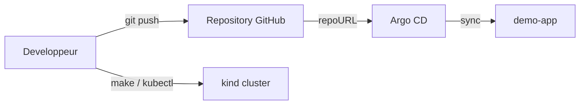
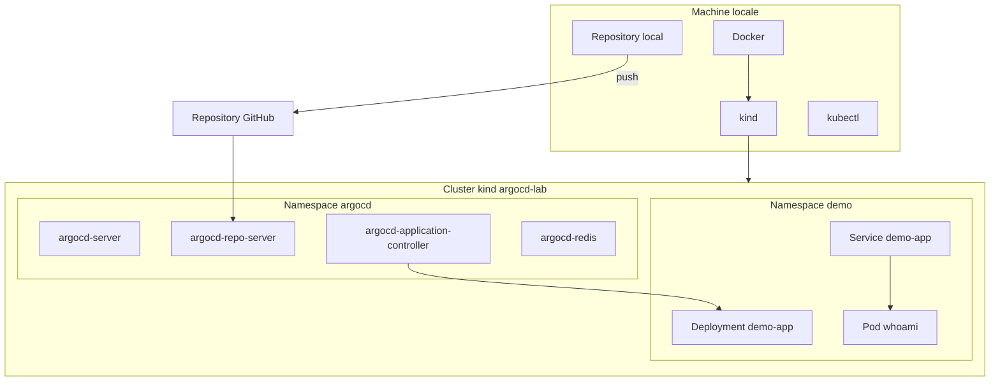

# Architecture

## Contexte

Le projet implemente un laboratoire GitOps local. L'objectif n'est pas seulement d'installer Argo CD, mais de fournir un cadre lisible qui montre clairement:

- ou se trouve la source de verite;
- comment Argo CD accede au repository;
- quels objets pilotent le deploiement;
- quelles limites existent dans un environnement local.

## Vue logique



## Vue de deploiement



## Decoupage du repository

### `apps/`

Zone des manifests applicatifs. C'est la partie metier du depot, independante du controleur GitOps lui-meme.

### `argocd/`

Zone de pilotage Argo CD:

- `AppProject` pour definir le perimetre d'autorisation;
- `Application` pour declarer quoi deployer, depuis ou, et vers quelle destination.

### `scripts/`

Scripts shell pour simplifier les operations locales et rendre le lab reproductible.

### `docs/`

Documentation de reference et guides d'exploitation.

## Flux de controle

1. le developpeur modifie les manifests dans `apps/demo-app`;
2. le changement est commit et pousse sur GitHub;
3. Argo CD detecte une difference entre Git et le cluster;
4. Argo CD applique le manifeste cible dans Kubernetes;
5. Kubernetes cree ou met a jour les ressources;
6. Argo CD continue ensuite a surveiller l'etat.

## Objets Argo CD

### `AppProject`

Le projet `demo-project` restreint:

- les repositories sources autorises;
- la destination Kubernetes autorisee;
- les ressources de cluster permises.

### `Application`

L'application `demo-app` definit:

- `repoURL`: le repository GitHub source;
- `targetRevision`: la branche suivie;
- `path`: le chemin de l'application dans le repo;
- `destination`: le cluster et namespace cibles;
- `syncPolicy.automated`: l'auto-sync et l'auto-heal.

## Choix structurants

- `kind` a ete retenu pour disposer d'un cluster local reproductible dans Docker.
- Argo CD est epingle a `v3.3.4` pour limiter la derive de version.
- Le repo GitHub est la source de verite, meme pour un lab local.
- L'application de demo est volontairement minimale pour garder l'attention sur le GitOps.

## Limites actuelles

- pas de gestion des secrets;
- pas de separation `dev` / `staging` / `prod`;
- pas d'ingress public;
- pas de pipeline CI;
- pas d'observabilite avancee.

## Evolutions recommandees

- introduire Kustomize overlays par environnement;
- ajouter des checks de validation dans CI;
- modeliser plusieurs applications;
- introduire `ApplicationSet`;
- ajouter une gestion de secrets compatible GitOps.

## Architecture cible du repository

La structure actuelle privilegie l'apprentissage. A moyen terme, la trajectoire recommande est la suivante:

```text
apps/
  demo-app/
    base/
    overlays/
      dev/
      staging/
      prod/

argocd/
  projects/
  applications/
```

Cette cible permet:

- une separation nette entre la base applicative et les variations par environnement;
- une meilleure lisibilite des objets Argo CD;
- une montee en charge plus propre vers plusieurs applications.

Le detail de cette projection est documente dans [docs/target-structure.md](/root/ArgoCD/docs/target-structure.md).
