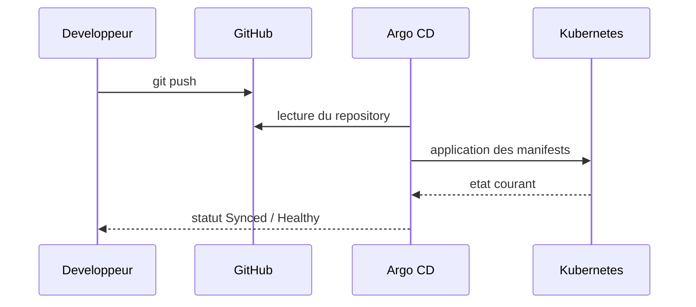

# Workflow GitOps

## Definition

GitOps signifie ici que Git definit l'etat desire du bastion Guacamole.

Argo CD compare cet etat desire avec Kubernetes et applique les changements necessaires.

## Cycle de vie du changement

## Source de verite

- le repository GitHub
- la branche `main`
- le chemin `apps/guacamole`

## Exemple de changement

1. modification de [`secret.yaml`](/root/ArgoCD/apps/guacamole/base/secret.yaml#L1)
2. commit et push
3. Argo CD detecte le diff
4. le cluster est reconcilie
5. tu verifies sur `guacamole.local`
