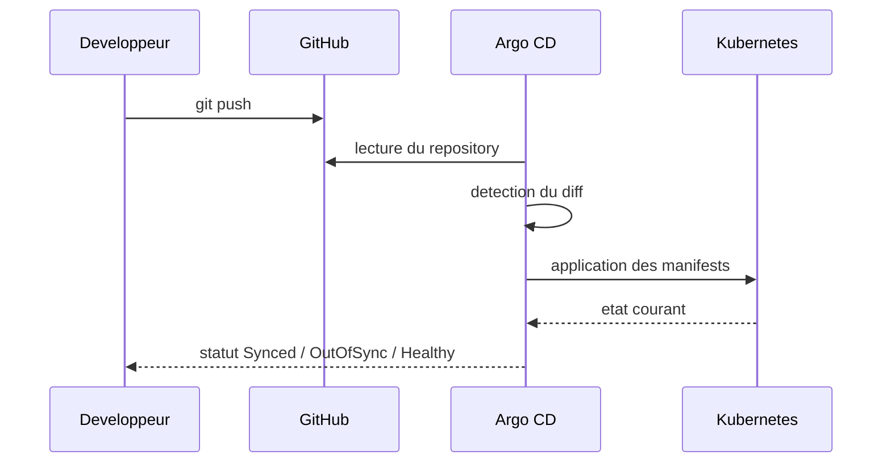

# Workflow GitOps

## Definition

Dans ce projet, GitOps signifie que Git definit l'etat desire du cluster. Argo CD compare cet etat desire avec l'etat reel de Kubernetes et applique les changements necessaires.

## Cycle de vie du changement

## Source de verite

La source de verite est:

- le repository GitHub;
- la branche `main`;
- le chemin de l'overlay cible, par exemple `apps/demo-app/overlays/dev`.

Le poste local n'est jamais la source de verite finale tant qu'un changement n'est pas pousse.

## Pourquoi le bootstrap est protege

Le script [`scripts/bootstrap-gitops.sh`](/root/ArgoCD/scripts/bootstrap-gitops.sh#L1) verifie deux choses:

- l'absence de modifications non committees;
- la synchronisation stricte avec `origin/main`.

Ce comportement est volontaire. Il force une discipline GitOps saine:

- ce qui est applique doit etre versionne;
- ce qu'Argo CD lit doit etre exactement ce qui est pousse.

## Etats Argo CD a connaitre

| Etat | Signification |
| --- | --- |
| `Synced` | Le cluster correspond a Git. |
| `OutOfSync` | Le cluster differe de Git. |
| `Healthy` | Les ressources sont considerees operationnelles. |
| `Degraded` | Une ou plusieurs ressources sont en erreur. |
| `Missing` | Une ressource attendue n'existe pas dans le cluster. |

## Exemple de changement

Cas simple:

1. modification du nombre de replicas dans `apps/demo-app/overlays/dev/deployment-patch.yaml`;
2. commit et push sur `main`;
3. Argo CD detecte un diff;
4. le `Deployment` est mis a jour;
5. Kubernetes lance les nouveaux pods;
6. l'application repasse en `Synced`.

## Bonnes pratiques

- faire des changements petits et lisibles;
- versionner les manifests Argo CD et applicatifs dans le meme depot au debut;
- centraliser le commun dans `base/` et les differences dans `overlays/`;
- conserver une separation claire entre definition applicative et pilotage GitOps;
- eviter les modifications manuelles dans le cluster;
- utiliser des messages de commit explicites.
